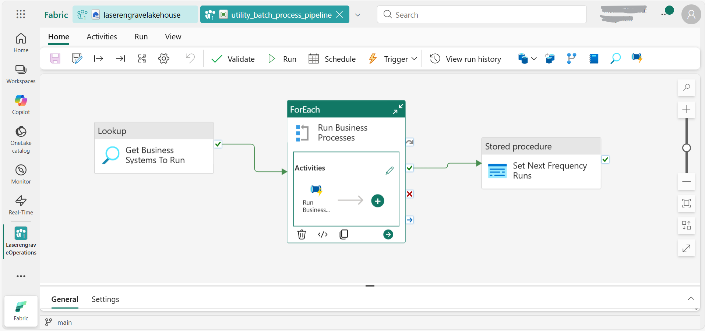

```
Workflow steps of the Inventory Source to Target Pipeline process

Inventory Batch process pipeline

&nbsp;   Inventory\_process\_pipeline (Run Business Systems) -> Operation Status

&nbsp;       utility\_getmetadata\_pipeline (Business Pipeline)

&nbsp;           utility\_status\_message\_pipeline 

&nbsp;               (Send Business Notification - switch to determine email 

&nbsp;                message based on status: success, fail, undefined)

&nbsp;                   utility\_notification\_pipeline 

&nbsp;                       (Handle User Notification - Email module)

```



