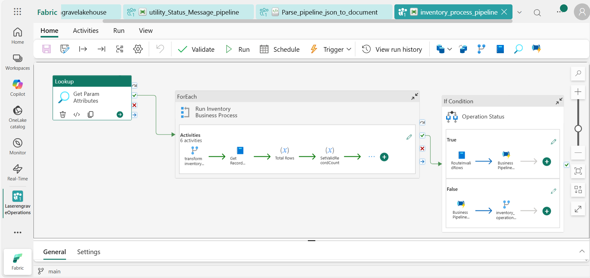

  Pipeline Documentation: inventory_process_pipeline

  Overview

 Pipeline name: inventory_process_pipeline
 Number of activities: 3

  Activities

 1. Get Param Attributes
 Type: `Lookup`
 Description: Retrieve the configuration parameters from the synapse database, source parameters, format of data, target details, and so forth...

 2. Run Inventory Business Process
 Type: `ForEach`
 Description: Run in iteration, the sources of files, tables, source picked from the configuration table pick their attributes; files names, file types, source, and target location

 3. Operation Status
 Type: `IfCondition`
 Description: Conditional branching: If invalid records exist, log in audit, partition files, and send notification email, if retry is activated, process is rerun.

