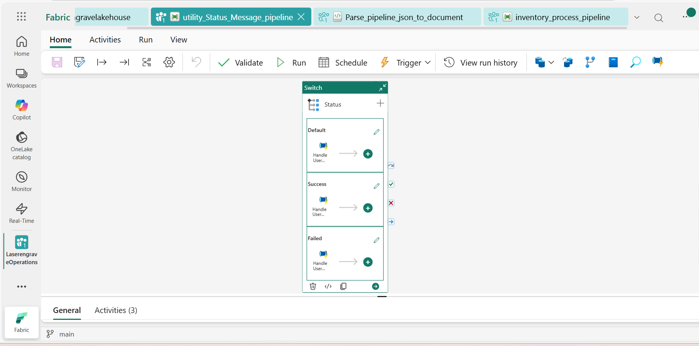

#  Pipeline Documentation: **utility_Status_Message_pipeline**

---

##  Overview

- **Pipeline name:** utility_Status_Message_pipeline
- **Number of activities:** 1

---

##  Activities

### 1. **Status**
- **Type:** `Switch`
- **Description:** The generic email notification pipeline component that is plugged into the workflow, the status of a upstream task success, failed, innactive, are passed into this switch activity

