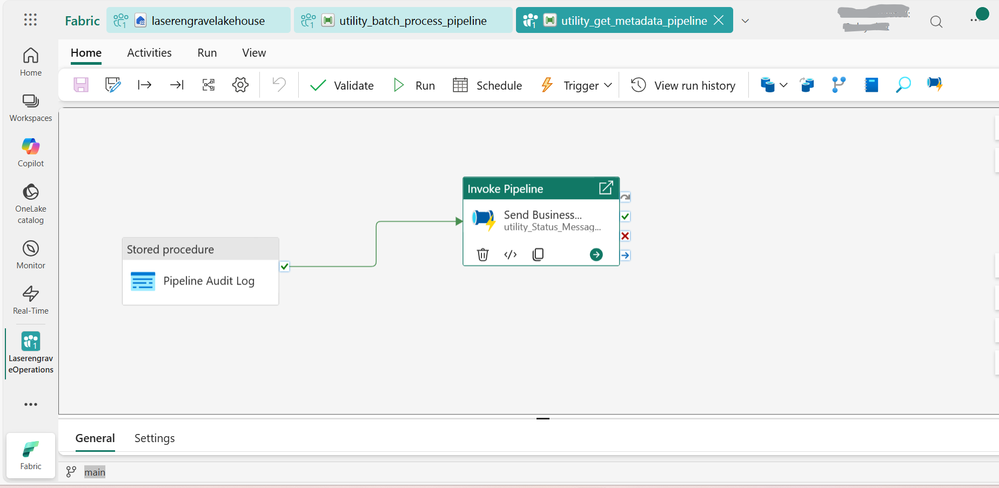

#  Pipeline Documentation: **utility_get_metadata_pipeline**

---

##  Overview

- **Pipeline name:** utility_get_metadata_pipeline
- **Number of activities:** 2

---

##  Activities

### 1. **Pipeline Audit Log**
- **Type:** `SqlServerStoredProcedure`
- **Description:** All process details of a run, are passed in, to log all the details of the workflow process in the Fabric Warehouse

### 2. **Send Business Notification**
- **Type:** `InvokePipeline`
- **Description:** Generic Black-box execute-pipeline that processes business user notification emails about the status of the process; success, fail, inactivity. Can be plugged into any pipeline for notifications

